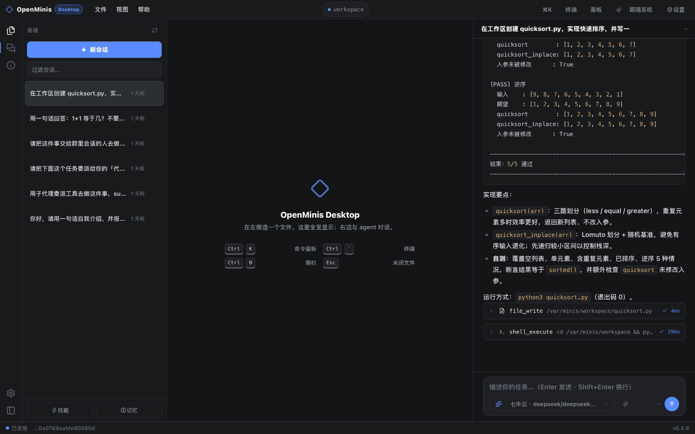
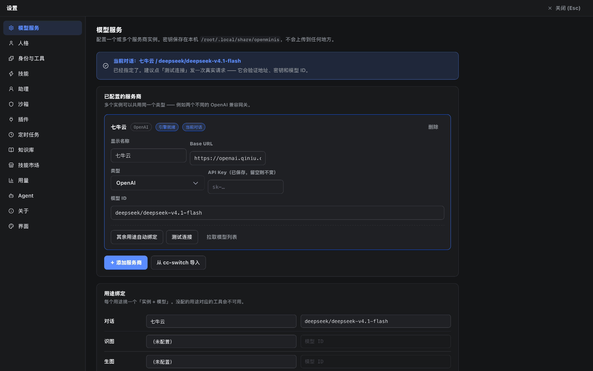

<div align="center">


# OpenMinis Desktop

**把 OpenMinis 的 agent 内核，装进一个 Windows 原生窗口。**

一个能真正在你机器上执行命令的桌面 agent 工作台 ——
对话、工具调用、文件树、内置终端、改动 diff，全在一个窗口里。

[**下载**](#下载) · [界面](#界面) · [它是什么](#它是什么) · [桌面壳做了什么](#桌面壳做了什么) · [从源码跑](#从源码跑) · [文档](#文档)



<sub>真实截图：左边会话列表，中间空着给打开的文件，右边是一次完整对话 —— 测试输出、工具卡片（`file_write` 4ms / `shell_execute` 29ms）、状态栏的 `已连接` 与版本号。</sub>

</div>

---

## 下载

**→ [最新版本](../../releases/latest)** · 免安装，解压即用，**不需要装 Python 或 Node**。

| 文件 | 大小 | 用途 |
|---|---|---|
| `OpenMinisDesktop-portable.zip` | 39.5 MB | 完整程序，解压后双击文件夹里的 `OpenMinisDesktop.exe` |
| `OpenMinisDesktop-update.zip` | 2.4 MB | 只更新内核与界面时用的载荷包，**由应用自己下载**，一般不用手动拿 |
| `latest.json` | 1 KB | 更新清单，应用里点「检查更新」时读的就是它 |

解压后进 **设置 → 模型服务** 填一个 API Key（OpenAI、Anthropic，或任意 OpenAI 兼容网关），
就能开始对话。

> **双击没反应？** Windows 会给「从网上下载的文件」打上来源标记（MOTW），
> 而它的自带解压工具会把这个标记传染给解压出来的每一个文件 —— .NET 因此拒绝加载 DLL。
> 应用会**自己检测到并弹窗问你要不要解除锁定**，点「是」即可。
> 想完全避开：用 7-Zip / Bandizip 解压，或先右键 zip → 属性 → 勾「解除锁定」。
> 机制见 [`docs/DESKTOP.md`](docs/DESKTOP.md#45-网络来源标记motw便携版在别人电脑上打不开的头号原因)。

---

## 界面

**全部设置都内嵌在桌面窗口里** —— 模型服务（多实例 + 用途绑定 + 真实连通性测试）、人格、
身份与工具、技能、助理、沙箱、插件、定时任务、知识库、技能市场、用量、Agent 参数、界面、关于。
不用再跳回移动端界面去改配置。



| 键 | 作用 |
|---|---|
| `Ctrl+K` | 命令面板 |
| `Ctrl+N` / `Ctrl+O` | 新建会话 / 打开文件夹 |
| `` Ctrl+` `` | 终端抽屉 |
| `Ctrl+B` | 侧栏 |
| `Ctrl+,` | 设置 |
| `Ctrl+=` / `Ctrl+-` / `Ctrl+0` | 放大 / 缩小 / 重置界面缩放 |
| `Enter` / `Shift+Enter` | 发送 / 换行 |
| `Esc` | 关面板 / 停止生成 |

---

## 它是什么

**是**：一个能真正在 Windows 上跑的桌面 agent 应用。原生窗口（WebView2），
内置终端、文件树、代码查看、agent 改文件的 diff、命令面板，以及一个能覆盖日常配置的
设置界面。

**不是**：一个完整的 IDE。没有 LSP、没有多文件重构、没有代码补全模型 ——
编辑能力来自 agent 本身，不是来自编辑器。它的定位是「**带一个真 shell 的 agent 工作台**」。

**也不是**：从零写的。内核 100% 来自开源上游，见 [署名](#署名与许可)。

**数据**全部留在本机 `%USERPROFILE%\openminis`（即 `C:\Users\<你>\openminis`），
会话库、技能、记忆都在那儿。删掉程序目录不影响数据 —— 换版本、换电脑都只是搬程序目录的事。

---

## 桌面壳做了什么

上游提供了 agent 内核 + FastAPI + 一个移动端形态的 Web UI。桌面版在**外面**加了一层壳，
**没有改动内核一行**（`src/` 至今 0 改动）—— 这是刻意的：上游可以随时更新，我们的改动
全在 `desktop/` 与 `web/desktop/`，diff 里泾渭分明，合并冲突几乎为零。

```
┌─ desktop/ ──────────── 窗口外壳（pywebview + uvicorn 后台线程）
│  ├─ access_gate.py      访问闸门：Host / Origin / 令牌 三道
│  ├─ updater.py          应用内更新：检查 → 下载 → 校验 → 原子替换 → 重启
│  ├─ motw.py             网络来源标记自检与一键解除
│  ├─ paths.py            载荷优先的导入与资源查找
│  └─ fatal.py            启动期失败：写日志 + 弹原生对话框
├─ web/desktop/ ──────── 桌面界面（纯 HTML/CSS/JS，**无构建步骤**）
└─ payload/ ──────────── 可整体替换的「内核 + 界面」（见下）
```

### 1. 界面用「插到路由表最前面」的方式挂载，而不是改内核

`desktop/ui_mount.py` 把桌面路由插到 FastAPI 路由表的**最前面**。原因是内核里有个
`@app.get("/{full_path:path}")` 兜底路由，任何追加在它后面的路由都是死代码；
插到前面既能生效，又不用碰上游文件。

### 2. 内核与界面是可整体替换的 `payload/`

改内核一行，本来要重发整个 39 MB。现在「运行时（解释器 + 依赖）」留在 exe 里，
「内核 + 界面」装成 exe 旁边的 `payload/` 目录：

| | 大小 | 什么时候 |
|---|---|---|
| 只换载荷 | **2.4 MB** | 改了内核、改了界面 |
| 换整包 | 39.5 MB | 改了**壳**（启动流程、依赖、PyInstaller 配置） |

判据不是版本号（版本号每次都变，那样等于每次都下整包），而是**壳指纹**：
对壳的源码取哈希、签进 `desktop/build_id.py`，由 `scripts/shell_id.py` 生成，
`desktop/tests/test_updater.py` 钉住 —— 改了壳忘了重算，测试直接红。

替换是**原子**的：新的先解到旁边的临时目录 → 查验 → 旧的改名让位 → 新的挪进来，出错回滚。
Python 导入完 `.pyc` 就不持有文件句柄，所以运行中重命名 `payload/` 在 Windows 上也成立。

### 3. 本地服务有访问闸门

内核给手机端用时 loopback 基本等于「只有自己」；桌面壳把它放到了用户的电脑上，威胁模型变了：
用户访问的任意网页都有可能去读写 `127.0.0.1:8765`，而这个 agent 手里**有 shell**。

所以壳这层加了三道闸（`desktop/access_gate.py`，一行 `src/` 都没改）：
**Host 白名单**（挡 DNS rebinding）→ **Origin 白名单**（跨站一律拒，即使带有效令牌）→
**令牌**（窗口地址 `?k=` 换成 `HttpOnly + SameSite=Strict` 的 cookie，同源自动带上、跨站不带）。

这道闸做过一轮**独立的对抗性复核**（派另一个模型专门去攻破），结论是挡得住；
过程中抓到的真问题（串行启动路径漏传令牌 → 窗口能开但每个 API 都 403）已修并加了护栏。

### 4. 单实例

再次启动会探测端口上已有的实例并复用，不会起第二个内核、出现两套会话库。

---

## 从源码跑

### 自己构建

```bat
git clone <this repo>
cd OpenMinisDesktop
build-desktop.bat
```

需要 Windows + Python 3.11+（`py -3` 或 `python` 在 PATH 里）。脚本会自己建 `.venv`、
装依赖、跑 PyInstaller、组装 `payload/`，产物在 `dist\OpenMinisDesktop\`。

### 直接跑源码（任何平台）

```bash
pip install -e . "pywebview>=5.0"
python desktop_main.py                 # 原生窗口
python desktop_main.py --browser       # 没有 GUI 工具链时，退回浏览器标签页
python desktop_main.py --no-window     # 只跑后端（服务器 / 无头模式）
python desktop_main.py --upstream-ui   # 用上游移动端界面
```

| 参数 | 说明 |
|---|---|
| `--host` / `--port` | 绑定地址与端口，默认 `127.0.0.1:8765`；端口被占用时自动换一个 |
| `--browser` / `--no-window` | 浏览器标签页 / 只跑后端 |
| `--width` / `--height` | 初始窗口尺寸，默认 1440×900 |
| `--upstream-ui` | `/` 用上游移动端界面 |
| `--debug` | 打开 WebView devtools 与详细日志 |

### 验证

**唯一入口**是：

```bash
python scripts/check.py
```

它跑四步：全部测试（`tests/` + `desktop/tests/`）、静态检查（ruff F821/F811）、
前端检查（`npm run check`）、桌面壳冒烟测试。当前 **949 passed / 2 skipped**。

CI（`.github/workflows/build-windows.yml`）在 `windows-latest` 上每次提交都会：
构建便携版 → 断言内核确实从 `payload/` 加载 → 带窗口探一次原生缩放能力 →
**模拟浏览器下载（给产物打上 MOTW）再启动一次，验证自愈** → 产更新清单 → 挂 release。
另有一个 `Verify` 工作流跑 `check.py` 全量。

---

## 已知限制

写在这里而不是藏着 —— 它们都是**知道且认了的**取舍，不是没想到。

| 限制 | 说明 |
|---|---|
| **整包更新还不能自动装** | 壳变了（比如 v0.4.6 → v0.4.7）时，应用会告诉你「这次需要整包」，但不会自己替换正在运行的 exe，得手动换。载荷更新是全自动的 |
| **没有代码签名** | 没签名的 exe 每次更新都会吃一次 SmartScreen 提示；这也是「防不住有人改 GitHub 上的 release」的正解，一并留给后面 |
| **校验只到 sha256** | 防得住下载被截断／代理返回旧包，**防不住**有人改 release 上的文件（那需要签名） |
| **闸门挡的是「别人」** | 如果界面本身渲染了用户可控的 HTML（stored XSS），那它同源、无 Origin、带 cookie，闸门形同虚设。见 `docs/DESKTOP.md` 的残余风险一节 |
| **MOTW 自愈有环境局限** | CI 的 runner（Windows Server 2022）上 .NET 不理会这个标记，所以 CI 证的是「检测 + 解除 + 应用照常启动」，真实复现来自用户的 Windows 11 机器 |
| **前端没有自动化测试** | `web/desktop/app.js` 是单文件、零构建，也零测试；最近几轮前端 bug 全靠人复现。想拆成原生 ES module 并把 DOM harness 落成 node 测试，还没做 |
| **只有 Windows 产物** | 内核本身跨平台，缺的是打包脚本与各平台窗口后端的验证 |
| **vendored 内核没有回流路径** | 偏离上游的地方记在 `NOTICE.md`（`# PORT-FIX:` 标记），只增不减 |

## 路线图

- [x] 设置界面全部内嵌进桌面窗口
- [x] 主题三态（跟随系统 / 浅色 / 深色）
- [x] 本地服务的访问闸门（Host / Origin / 令牌）
- [x] 内核与界面拆成可替换的 `payload/`（更新 39 MB → 2.4 MB）
- [x] 应用内一键更新（载荷）+ 壳指纹判据
- [x] 启动期失败不再静默（日志 + 原生对话框）
- [ ] 整包更新 + 安装器（per-user 装到 `%LOCALAPPDATA%`，不触发 UAC）
- [ ] 代码签名 + release 签名校验
- [ ] WebView2 Evergreen 引导（老 Win10 上缺运行时的引导安装）
- [ ] 多标签工作区（同时开多个会话）
- [ ] 编辑器内直接改文件并保存（目前编辑能力全在 agent 侧）
- [ ] 会话搜索走 SQLite FTS，而不是前端过滤
- [ ] macOS / Linux 打包产物

## 文档

| 文件 | 内容 |
|---|---|
| [`docs/DESKTOP.md`](docs/DESKTOP.md) | 架构与实现细节：进程模型、为什么用运行时挂载、界面协议、打包、MOTW、已知限制 |
| [`docs/ARCH-REVIEW-2026-09-30.md`](docs/ARCH-REVIEW-2026-09-30.md) | 一次**抛开项目自有规矩**的纯架构检查（6 条按重要性排序的结论，后续三步改造就是从它来的） |
| [`CHANGELOG.md`](CHANGELOG.md) | 每个版本改了什么、为什么、验证到哪一步（包括没做到的） |
| [`NOTICE.md`](NOTICE.md) | 上游来源与偏离清单 |
| [`docs/adr/`](docs/adr) | 架构决策记录 |

---

## 署名与许可

本项目是 **[OpenMinis](https://github.com/OpenMinis/OpenMinis)**（GPL-3.0）的派生作品，
`src/` 下的内核代码来自社区的 **[littlhub/PythonOpenMinis](https://github.com/littlhub/PythonOpenMinis)**
（Kotlin/Android 客户端的 Python 移植）。

因此本项目同样以 **GPL-3.0** 分发，完整许可见 [LICENSE](LICENSE)，
来源与改动范围见 [NOTICE.md](NOTICE.md)。

窗口用 [pywebview](https://pywebview.flowrl.com)（BSD-3-Clause），
界面组件用 [Web Awesome](https://webawesome.com)。

感谢上游作者把这么好的东西开源。
